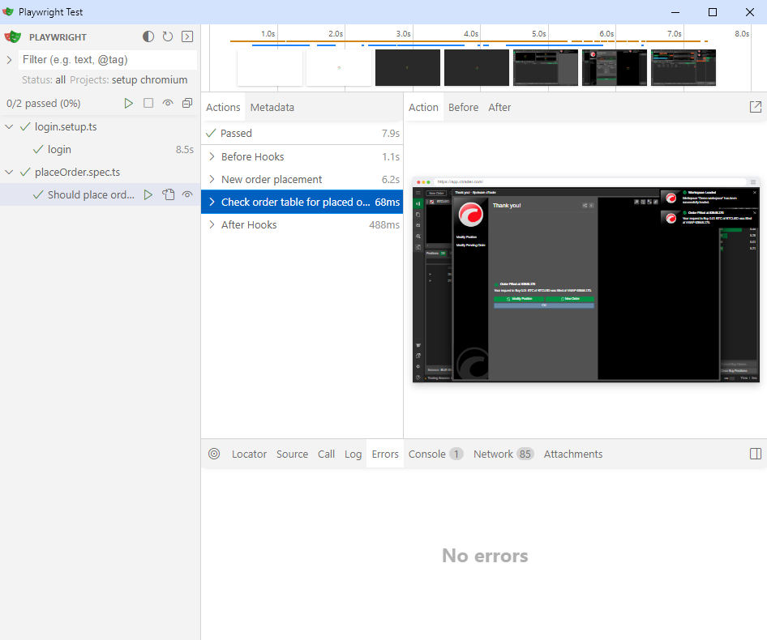
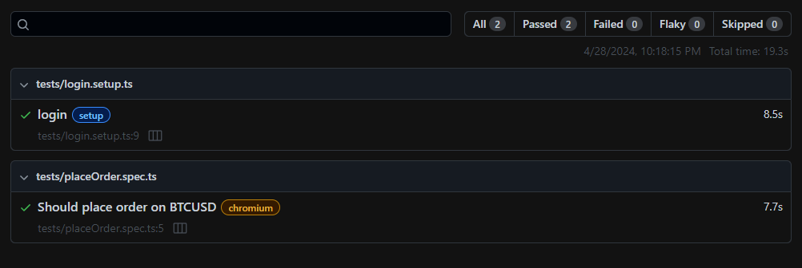

# Typescript + Playwright

## Description

Spotware trading platform

## Preparation to launch

Firstly, you should **create .env file in a project root.**  
and fill it like that:  

LOGIN=xxxx  
PASSWORD=xxxx  

*<u>(where xxxx - actual login/password data)</u>*

## Launch

There is 2 options to launch tests:  
**(Make sure you navigated to project folder after cloning it)**

- With basic manual node modules installation:  `npm install` 
  <u>After installation all the tests will be available with commands:</u>  
  `npm run test`
  `npm run test-ui`
  `npm run report`

- With docker command *(Make sure you have docker installed and launched)*:  `docker-compose up --build` 
  <u>After creation of docker container you can quickly check one test with command:</u>  
  `docker run -it spotware-e2e:latest npm run test`

## Usage

This project is needed to test basic https://app.ctrader.com functionalities:
- Login
- Order creation

